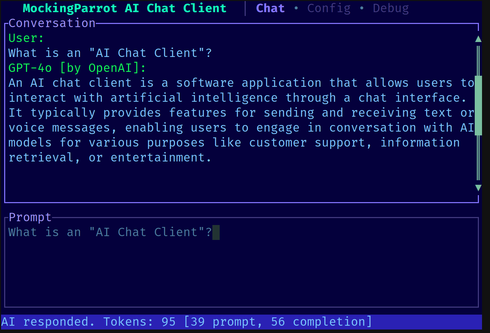

[](https://crates.io/crates/mockingparrot)
[](https://unlicense.org)

# MockingParrot
A TUI chat client for OpenAI and Anthropic.



## Getting started
Download a precompiled binary from the [GitHub Releases page](https://github.com/ArielHorwitz/mockingparrot/releases). Or, if you have the Rust toolchain then run:
```
cargo install mockingparrot
```

You will need an API key from one of the providers (OpenAI or Anthropic) and copy it into the config file.

Version upgrades may not be backward compatible: if you are upgrading to a newer version, you _may_ need to remove your config file or other saved data.
